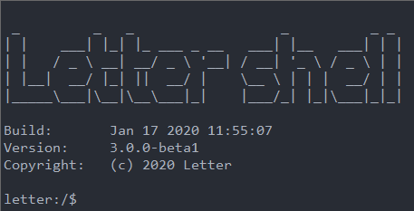

# letter shell 3.0


一个功能强大的嵌入式shell



- [letter shell 3.0](#letter-shell-30)
  - [简介](#简介)
  - [功能](#功能)
  - [移植说明](#移植说明)
  - [使用方式](#使用方式)
    - [函数定义](#函数定义)
      - [main函数形式](#main函数形式)
      - [普通C函数形式](#普通c函数形式)
      - [在函数中获取当前shell对象](#在函数中获取当前shell对象)
  - [命令定义](#命令定义)
    - [定义方式](#定义方式)
    - [定义宏说明](#定义宏说明)
    - [命令属性字段说明](#命令属性字段说明)
    - [权限系统说明](#权限系统说明)
    - [建议终端软件](#建议终端软件)

## 简介

[letter shell 3.0](https://github.com/NevermindZZT/letter-shell/tree/shell3.0)是一个C语言编写的，可以嵌入在程序中的嵌入式shell，主要面向嵌入式设备，以C语言函数为运行单位，可以通过命令行调用，运行程序中的函数

相对2.x版本，letter shell 3.0增加了用户管理，权限管理，后续会增加对文件系统的支持

此外3.0版本修改了命令格式和定义，2.x版本的工程需要经过简单的修改才能完成迁移

## 功能

- 命令自动补全
- 快捷键功能定义
- 命令权限管理
- 用户管理
- 变量支持

## 移植说明

1. 定义shell对象

    ```C
    Shell shell;
    ```

2. 定义shell读，写函数，函数原型如下

    ```C
    /**
     * @brief shell读取数据函数原型
     *
     * @param char shell读取的字符
     *
     * @return char 0 读取数据成功
     * @return char -1 读取数据失败
     */
    typedef signed char (*shellRead)(char *);

    /**
     * @brief shell写数据函数原型
     *
     * @param const char 需写的字符
     */
    typedef void (*shellWrite)(const char);
    ```

3. 申请一片缓冲区

    ```C
    char shellBuffer[512];
    ```

4. 调用shellInit进行初始化

    ```C
    shell.read = shellRead;
    shell.write = shellWrite;
    shellInit(&shell, shellBuffer, 512);
    ```

5. 调用(建立)shell任务

    对于运行在操作系统的情况，建立`shellTask`任务(确保sell_cfg.h中的配置无误)，任务参数为shell对象

    ```C
    OsTaskCreate(shellTask, &shell, ...);
    ```

    对于裸机环境，在主循环中调用`shellTask`，或者在接收到数据时，调用`shellHandler`

6. 说明

   - 对于中断方式使用shell，不用定义`shell->read`，但需要在中断中调用`shellHandler`
   - 对于使用操作系统的情况，使能```SHEHLL_TASK_WHILE```宏，然后创建shellTask任务

7. 其他配置

   - 定义宏`SHELL_GET_TICK()`为获取系统tick函数，使能tab双击操作，用户长帮助补全

8. 配置宏

    shell_cfg.h文件中包含了所有用于配置shell的宏，在使用前，需要根据需要进行配置

    | 宏                          | 意义                           |
    | --------------------------- | ------------------------------ |
    | SHELL_TASK_WHILE            | 是否使用默认shell任务while循环 |
    | SHELL_USING_CMD_EXPORT      | 是否使用命令导出方式           |
    | SHELL_HELP_LIST_USER        | 是否在输入命令列表中列出用户   |
    | SHELL_HELP_LIST_VAR         | 是否在输入命令列表中列出变量   |
    | SHELL_HELP_LIST_KEY         | 是否在输入命令列表中列出按键   |
    | SHELL_ENTER_LF              | 使用LF作为命令行回车触发       |
    | SHELL_ENTER_CR              | 使用CR作为命令行回车触发       |
    | SHELL_ENTER_CRLF            | 使用CRLF作为命令行回车触发     |
    | SHELL_COMMAND_MAX_LENGTH    | shell命令最大长度              |
    | SHELL_PARAMETER_MAX_NUMBER  | shell命令参数最大数量          |
    | SHELL_HISTORY_MAX_NUMBER    | 历史命令记录数量               |
    | SHELL_DOUBLE_CLICK_TIME     | 双击间隔(ms)                   |
    | SHELL_MAX_NUMBER            | 管理的最大shell数量            |
    | SHELL_GET_TICK()            | 获取系统时间(ms)               |
    | SHELL_DEFAULT_USER          | shell默认用户                  |
    | SHELL_DEFAULT_USER_PASSWORD | 默认用户密码                   |
    | SHELL_LOCK_TIMEOUT          | shell自动锁定超时              |

## 使用方式

### 函数定义

letter shell 3.0同时支持两种形式的函数定义方式，形如main函数定义的`func(int argc, char *agrv[])`以及形如普通C函数的定义`func(int i, char *str, ...)`，两种函数定义方式适用于不同的场景

#### main函数形式

使用此方式，一个函数定义的例子如下：

```C
int func(int argc, char *agrv[])
{
    printf("%dparameter(s)\r\n", argc);
    for (char i = 1; i < argc; i++)
    {
        printf("%s\r\n", argv[i]);
    }
}
SHELL_EXPORT_CMD(SHELL_CMD_PERMISSION(0)|SHELL_CMD_TYPE(SHELL_TYPE_CMD_MAIN), func, func, test);
```

终端调用

```sh
letter:/$ func "hello world"
2 parameter(s)
hello world
```

#### 普通C函数形式

使用此方式，shell会自动对参数进行转化处理，目前支持二进制，八进制，十进制，十六进制整形，字符，字符串的自动处理，如果需要其他类型的参数，请使用字符串的方式作为参数，自行进行处理，例子如下：

```C
int func(int i, char ch, char *str)
{
    printf("input int: %d, char: %c, string: %s\r\n", i, ch, str);
}
SHELL_EXPORT_CMD(SHELL_CMD_PERMISSION(0)|SHELL_CMD_TYPE(SHELL_TYPE_CMD_FUNC), func, func, test);
```

终端调用

```sh
letter:/$ func 666 'A' "hello world"
input int: 666, char: A, string: hello world
```

#### 在函数中获取当前shell对象

shell采取一个静态数组对定义的多个shell进行管理，shell数量可以修改宏`SHELL_MAX_NUMBER`定义(为了不使用动态内存分配，此处通过数据进行管理)，从而，在shell执行的函数中，可以调用`shellGetCurrent()`获得当前活动的shell对象，从而可以实现某一个函数在不同的shell对象中发生不同的行为，也可以通过这种方式获得shell对象后，调用`shellWriteString(shell, string)`进行shell的输出

## 命令定义

letter shell 3.0将可执行的函数命令定义，用户定义，按键定义以及变量定义统一归为命令定义，使用相同的结构储存，查找和执行

### 定义方式

letter shell 支持使用命令导出方式和命令表方式进行命令的添加，定义，通过宏```SHELL_USING_CMD_EXPORT```控制

命令导出方式支持keil，IAR(未测试)以及GCC

1. 命令导出方式

    letter shell 支持在函数体外部，采用定义常量的方式定义命令，例如`SHELL_EXPORT_CMD(SHELL_CMD_PERMISSION(0)|SHELL_CMD_TYPE (SHELL_TYPE_CMD_MAIN)|SHELL_CMD_DISABLE_RETURN,help, shellHelp, show command info\r\nhelp [cmd]);`

    对于使用keil进行编译，需要在keil的target option中增加--keep shellCommand*，防止定义的命令被优化掉

    使用GCC编译时，需要在ld文件中的只读数据区(建议)添加：

    ```ld
    _shell_command_start = .;
    KEEP (*(shellCommand))
    _shell_command_end = .;
    ```

2. 命令表方式

    - 当使用其他暂时不支持使用命令导出方式的编译器时，需要在`shell_cmd_list.c`文件的命令表中添加

        ```C
        const SHELL_CommandTypeDef shellDefaultCommandList[] =
        {
            SHELL_CMD_ITEM(
                       SHELL_CMD_PERMISSION(0)|SHELL_CMD_TYPE(SHELL_TYPE_CMD_MAIN)|SHELL_CMD_DISABLE_RETURN,
                       help, shellHelp, show command info\r\nhelp [cmd]),
        };
        ```

### 定义宏说明

letter shell 3.0对可执行命令，按键，用户以及变量分别提供了一个宏，用于进行命令定义

1. 可执行命令定义

    使用宏`SHELL_EXPORT_CMD`定义可执行命令，定义如下

    ```C
    /**
     * @brief shell 命令定义
     * 
     * @param _attr 命令属性
     * @param _name 命令名
     * @param _func 命令函数
     * @param _desc 命令描述
     */
    #define SHELL_EXPORT_CMD(_attr, _name, _func, _desc) \
            const char shellCmd##_name[] = #_name; \
            const char shellDesc##_name[] = #_desc; \
            const ShellCommand \
            shellCommand##_name SECTION("shellCommand") =  \
            { \
                .attr.value = _attr, \
                .data.cmd.name = shellCmd##_name, \
                .data.cmd.function = (int (*)())_func, \
                .data.cmd.desc = shellDesc##_name \
            }
    ```

2. 变量定义

    使用宏`SHELL_EXPORT_VAR`定义变量，定义如下

    ```C
    /**
     * @brief shell 变量定义
     * 
     * @param _attr 变量属性
     * @param _name 变量名
     * @param _value 变量值
     * @param _desc 变量描述
     */
    #define SHELL_EXPORT_VAR(_attr, _name, _value, _desc) \
            const char shellCmd##_name[] = #_name; \
            const char shellDesc##_name[] = #_desc; \
            const ShellCommand \
            shellVar##_name SECTION("shellCommand") =  \
            { \
                .attr.value = _attr, \
                .data.var.name = shellCmd##_name, \
                .data.var.value = (void *)_value, \
                .data.var.desc = shellDesc##_name \
            }
    ```

3. 用户定义

    使用宏`SHELL_EXPORT_USER`定义用户，定义如下

    ```C
    /**
     * @brief shell 用户定义
     * 
     * @param _attr 用户属性
     * @param _name 用户名
     * @param _password 用户密码
     * @param _desc 用户描述
     */
    #define SHELL_EXPORT_USER(_attr, _name, _password, _desc) \
            const char shellCmd##_name[] = #_name; \
            const char shellPassword##_name[] = #_password; \
            const char shellDesc##_name[] = #_desc; \
            const ShellCommand \
            shellUser##_name SECTION("shellCommand") =  \
            { \
                .attr.value = _attr|SHELL_CMD_TYPE(SHELL_TYPE_USER), \
                .data.user.name = shellCmd##_name, \
                .data.user.password = shellPassword##_name, \
                .data.user.desc = shellDesc##_name \
            }
    ```

4. 按键定义

    使用宏`SHELL_EXPORT_KEY`定义按键，定义如下

    ```C
    /**
     * @brief shell 按键定义
     * 
     * @param _attr 按键属性
     * @param _value 按键键值
     * @param _func 按键函数
     * @param _desc 按键描述
     */
    #define SHELL_EXPORT_KEY(_attr, _value, _func, _desc) \
            const char shellDesc##_value[] = #_desc; \
            const ShellCommand \
            shellKey##_value SECTION("shellCommand") =  \
            { \
                .attr.value = _attr|SHELL_CMD_TYPE(SHELL_TYPE_KEY), \
                .data.key.value = _value, \
                .data.key.function = (void (*)(Shell *))_func, \
                .data.key.desc = shellDesc##_value \
            }
    ```

    按键键值为在终端输入按键会发送的字符串序列，以大端模式表示，比如在SecureCRT中断，按下Tab键，会发送0x0B，则这个按键的键值为0x0B000000，如果按下方向上，会依次发送0x1B, 0x5B, 0x41, 则这个键的键值为0x1B5B4100

### 命令属性字段说明

在命令定义中，有一个`attr`字段，表示该命令的属性，具体定义为

```C
union
{
    struct
    {
        unsigned char permission : 8;                       /**< command权限 */
        ShellCommandType type : 4;                          /**< command类型 */
        unsigned char enableUnchecked : 1;                  /**< 在未校验密码的情况下可用 */
        unsigned char disableReturn : 1;                    /**< 禁用返回值输出 */
    } attrs;
    int value;
} attr;
```

在定义命令时，需要给定这些值，可以通过宏`SHELL_CMD_PERMISSION(permission)`, `SHELL_CMD_TYPE(type)`, `SHELL_CMD_ENABLE_UNCHECKED`, `SHELL_CMD_DISABLE_RETURN`快速声明

### 权限系统说明

letter shell 3.0的权限管理同用户定义紧密相关，letter shell 3.0使用8个bit位表示命令权限，当用户和命令的权限按位与为真，或者命令权限为0时，表示该用户拥有此命令的权限，可以调用改命令

### 建议终端软件

- 对于基于串口移植，letter shell建议使用secureCRT软件，letter shell中的相关按键映射都是按照secureCRT进行设计的，使用其他串口软件时，可能需要修改键值
